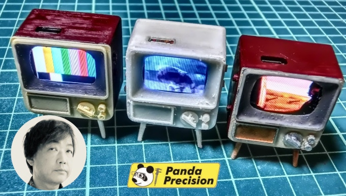
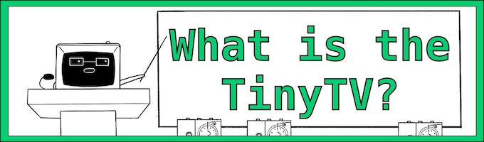
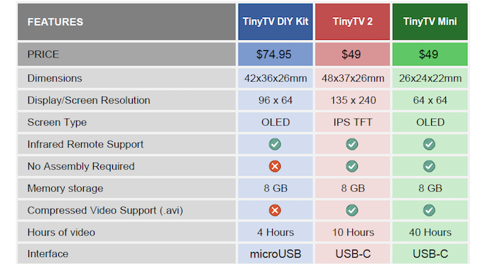
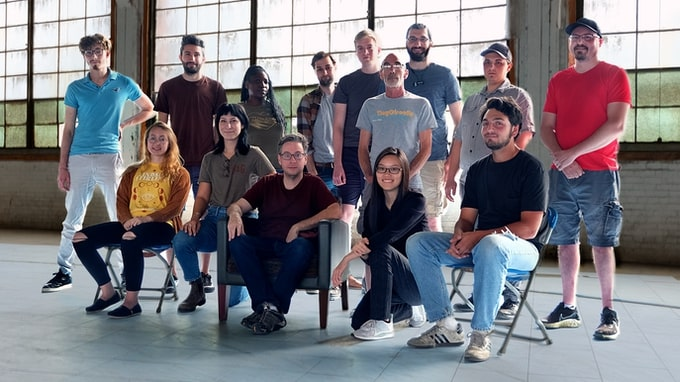

---
hide:
  - navigation
---
# 

The TinyTV 2 and TinyTV Mini are the latest in family of the TinyTV products, which began as a hobby project using the TinyCircuits TinyDuino family. Yashusi Enari, a TinyCircuits customer in Tokyo, Japan, discovered the <a href="https://tinycircuits.com/products/tinyscreenplus" target="_blank" alt="TinyScreen+ product page">**TinyScreen+**</a> and began creating his own tiny miniatures with these tiny screens. One of these projects was a retro miniature 3D printed television set, which he called the MAME-TV (Mame translates to "Bean" in English):

*Yashusi Enari's MAME-TV Project*

The project impressed his friends and gained enough popularity that Yashusi decided to start making more custom-painted TVs to sell to other miniature enthusiasts at events like Maker Faire Tokyo. He created a company named **Panda Precision** to do this, and started to collaborate with us at TinyCircuits to improve the kit.  He continued to 3D print and hand build all of the MAME-TVs in his Tokyo apartment, and it became increasingly popular where he had difficulty keeping up with demand.

Sadly, Yashusi was diagnosed with brain cancer in 2018 and began undergoing intensive treatment, which made it difficult to continue with his project that he was so passionate about.  In early 2019, a tumor was found in his brain, and he asked us to continue this project on his behalf. 

We then worked together on an improved version of the MAME-TV, which could scale up and be made available to more people - this work lead to the TinyTV DIY Kit.

Our friend Yashusi Enari passed away on May 1st, 2019. We miss him, and dedicate this project to his memory.

The MAME-TV project still lives on through Yashusi's friend Guru Hoshi in Japan, who continues making these <a href="https://g2hoshi.wixsite.com/mametv2 " target="_blank" alt="MAME-TV Website for custom hand painted miniature TVs">**amazing custom MAME-TVs**</a>.

---

#### What is the TinyTV?

Launched in late 2019, the <a href="https://tinycircuits.com/products/tinytv-diy-kit" target="_blank" alt="TinyTV DIY Kit product page">**TinyTV DIY Kit**</a> allowed people to create their own TinyTV, load their own videos, and paint the TV to look however they wanted. Built upon the TinyCircuits TinyDuino family, this kit has been extremely popular and well-received. 

While the kit aspect of this is fun for a lot of people, we did hear from others who would prefer it already assembled, and easier to load their own videos on. So we began working on the next generation TinyTV platform including the TinyTV 2 and TinyTV Mini. Check out this video displaying the differences in the TinyTV screens using prototype versions of the TinyTV 2 and TinyTV Mini:

<iframe width="560" height="315" src="https://www.youtube.com/embed/1S8InR9V6xU" title="YouTube video player" frameborder="0" allow="accelerometer; autoplay; clipboard-write; encrypted-media; gyroscope; picture-in-picture; web-share" allowfullscreen></iframe>

Check out this comparison chart for a more in-depth look at the differences in tech specs:

---

#### About Us

We are <a href="https://tinycircuits.com/" target="_blank" alt="TinyCircuits homepage">**TinyCircuits**</a>, and we specialize in making small electronics for makers and hobbyists. 

*TinyCircuits' tiny & mighty team*

We house our own manufacturing operation in Akron, OH, where we assemble, test, and ship all our products. 

TinyCircuits is a supporter of open-source hardware and software and believes collaboration leads to faster innovation. Our products are all open-source and released under the Creative Commons Share-Alike 3.0 License. We are a proud supporter of the Open Source Hardware Association and have helped sponsor the Open Hardware Summit since 2013.

Our mission is to make cool stuff!

<a href="https://www.youtube.com/watch?v=-kd26o7dds8" target="_blank" alt="TinyCircuits Thumby Article Blog"><b>*Learn more about our company and space with this short video tour of our office by the YouTube channel HackMakeMod.*</b></a>

----

## Contact Us

You can post on the <a href="http://forum.tinycircuits.com/" target="_blank" alt="Tinycircuits forum">**TinyCircuits Forum**</a>, or get in touch with <a href="https://tinycircuits.com/pages/contact-us" target="_blank" alt="Send a message to tinycircuits support on this page">**TinyCircuits Customer Support**</a> for product, order, or technical questions.

If you want to chat about customizations or how you're using a TinyTV, the <a href="https://discord.gg/vzf3wQXVvm" target="_blank" alt="Tinycircuits Discord">**TinyCircuits Discord**</a> is a great place for real time conversations about TinyTVs and other TinyCircuits products! TinyCircuits Admins are available on the Discord, but please ask individual questions through our customer support portal so we can best assist you. 😊

