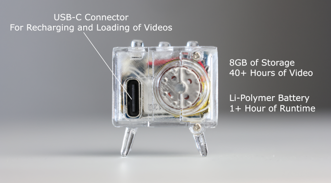

---
hide:
  - navigation
---

# 

**Charging** - To recharge your TinyTV, plug in a USB-C cable to the back of the TinyTV and the other end into a power source, like a computer or a USB wall charger.

**Turn On / Off** - There are three buttons on the top, the middle button will turn the TV on and off. You can also us the Tiny Remote to turn the TV on and off.

**Changing Volume** - The left button on the top of the TV will cycle between different volume settings.  

**Changing Channels** - The right button on the top of the TV will cycle between the different videos loaded on the TV.

---

## Tech Specs

* **Dimensions**: 26.3mm x 23.8mm x 21.9mm (1.0" x 0.94" x 0.86")
* **Display**: 65K Color OLED, 15.2mm (0.6"), 64x64 pixels
* **Battery**: Li-Polymer 3.7V, 50mAh, about 1 hour of video playback 
* **Storage**: Built in 8GB, about 40 hours of video playback
* **Audio**: Internal speaker
* **Inputs**: Power Button, Volume button, Channel button on the top of the unit
* **Remote**:  Can be controlled by an Infrared (IR) remote control
* **Processor**: Raspberry Pi RP2040 Processor
* **Connectivity**:  USB-C for uploading and battery charging 

