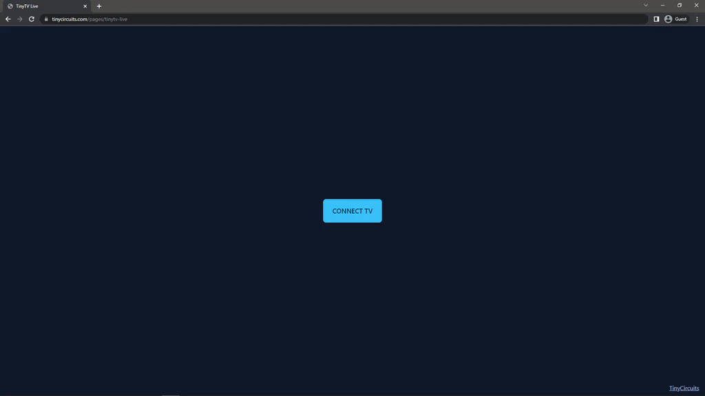
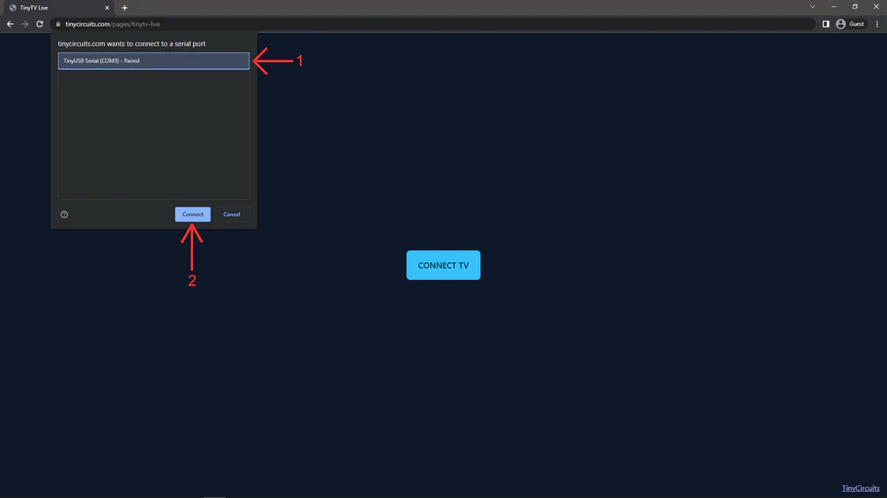
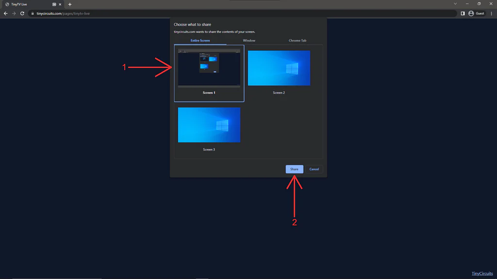
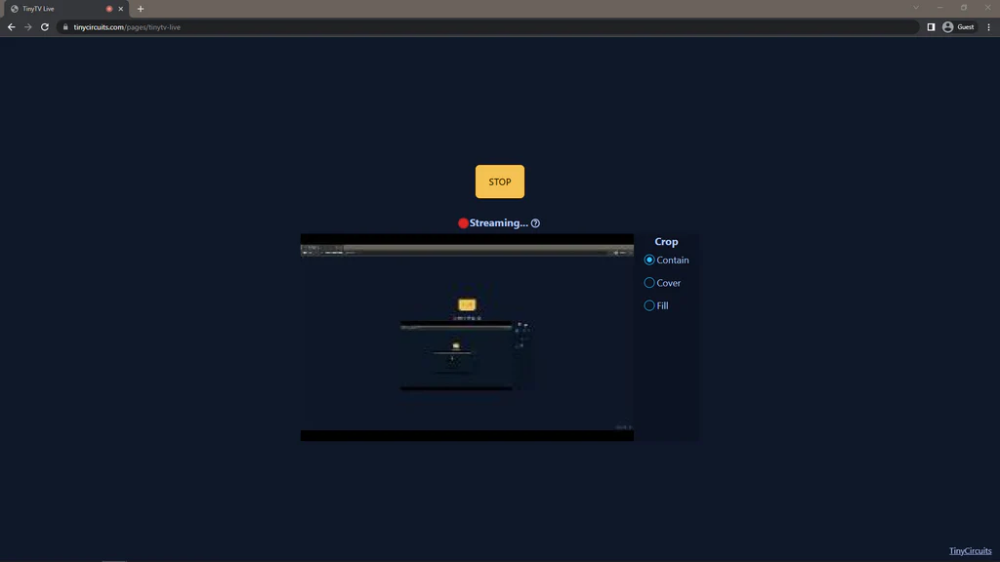

---
hide:
  - navigation
---
# 

This tutorial will show you how to connect a TinyTV 2 or TinyTV Mini to your computer and stream your computer screen to it!

---

**What you'll need:**

*   **TinyTV 2** or **TinyTV Mini**
*   A Chromium based browser (**Google Chrome**, **Microsoft Edge**, **Brave**, **Opera**, etc.). _Mozilla Firefox is not supported._

---

## How to stream

1.  Visit the streaming webpage: **[https://tinycircuits.com/pages/tinytv-live](https://tinycircuits.com/pages/tinytv-live "https://tinycircuits.com/pages/tinytv-live")**  
2.  Connect your TinyTV to your Windows, Mac, or Linux computer using a USB-C cable. 
    *  *NOTE: Windows 7/8 users may need to install a driver. Download the [**zadig**](https://github.com/pbatard/libwdi/releases/download/v1.4.1/zadig-2.7.exe "zadig downloader tool") tool and double click the .exe file to run it, plug in the TV and turn it on, select "Board CDC (interface 0)" in zadig (make sure nothing else is plugged into the computer), select "USB Serial (CDC)" and then click "Install Driver". See this [**github issue discussion**](https://github.com/raspberrypi/pico-feedback/issues/118#issue-823753492 "github issue discussion") for more information on what should be selected in zadig before clicking install.*
    *  *NOTE: Linux users may need to execute \`sudo adduser $USER dialout\` in a terminal*

3.  Turn the TV on 
    * TinyTV 2 - power button is on the top right of the TV
    * TinyTV Mini - power button is the top middle 

4.  Eject the TV by pressing the power button again, or eject the TV using your File Explorer (Windows) or Finder (Mac)
5.  Click the "CONNECT TV" button in the middle of the page, as seen below:

    
* Select the device with "TinyUSB Serial" in its name and then click the "Connect" button, like below _(NOTE: after the first time connecting the serial device, clicking the connect button will automatically connect your TV to the streaming tool and you won't need to choose it again)_  

    
* After the page auto detects your TV's type, you will be prompted to select a screen, window, or tab to stream. In this case, we'll choose to stream a desktop screen, as shown below:  

* At this point, your computer screen should be streaming to your TV! Click the "STOP" button or unplug your TV to go back to video playing mode, change the Crop mode to Contain, Cover, or Fill, or change the screen being streamed by clicking "STOP" and then "CONNECT TV" again.  

      

---

## Troubleshooting

**"Why don't I hear audio while live streaming?"**

*   Audio is not supported during live streaming at this time.

**"The screen is flashing or updates about once a second"**

*   Due to browser and OS throttling of unfocused or minimized windows, the webpage can't update the TV's screen often. A potential workaround is being developed.

**"I have a question that wasn't answered here"**

*   Please contact us using our **[contact form](https://tinycircuits.com/pages/contact-us "https://tinycircuits.com/pages/contact-us")**.

---

## Contact Us

If you have any questions or feedback, contact **[TinyCircuits support](https://tinycircuits.com/pages/contact-us "TinyCircuits email and contact form")**, make a post on the **[TinyCircuits forum](http://forum.tinycircuits.com/index.php "TinyCircuits Arduino forum")**, or join the conversation on **[Discord](https://discord.gg/zkvxTUtHMe)**.

Show us what you make by tagging @TinyCircuits on **[Instagram](https://www.instagram.com/tinycircuits/)**, [**Twitter**](https://twitter.com/tinycircuits), or [**Facebook**](https://www.facebook.com/TinyCircuits/) so we can feature it!

Thanks for making with us!