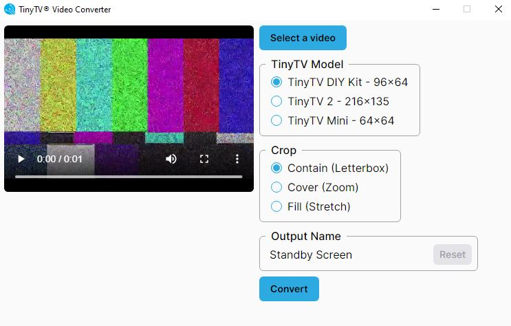
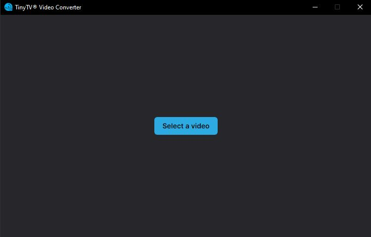
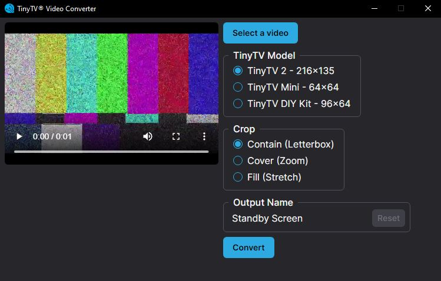
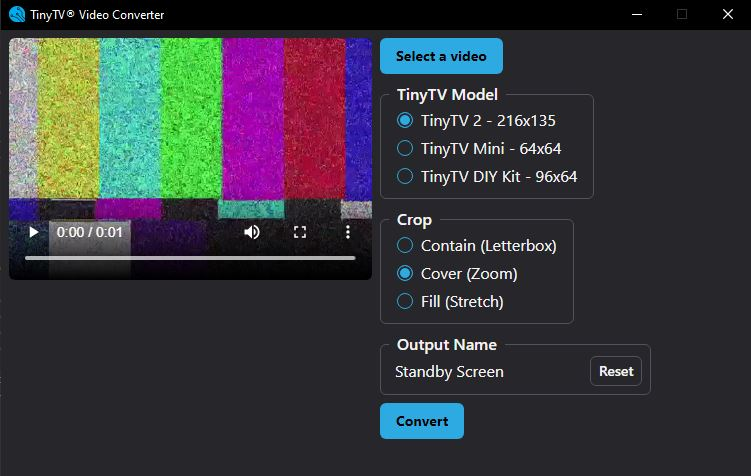
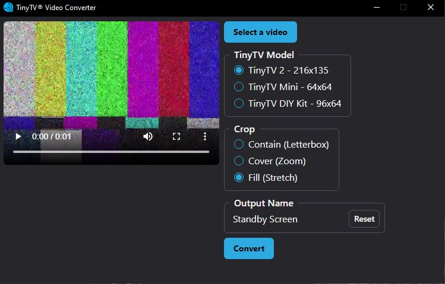

---
hide:
  - navigation
---

<!-- # TinyTV Converter App Download & Tutorial -->
#

_Note: If you are looking to convert videos to load onto the <a href="https://tinycircuits.com/products/tinytv-diy-kit" target="_blank" alt="TinyTV Kit product page">**TinyTV DIY Kit**</a>, <a href="https://tinycircuits.com/products/tinyarcade" target="_blank" alt="Tiny Arcade Kit product page">**Tiny Arcade**</a> or <a href="https://tinycircuits.com/products/pocket-arcade" target="_blank" alt="Pocket Arcade Kit product page">**Pocket Arcade**</a>, please refer to the <a href="https://learn.tinycircuits.com/Kits/TSV-Converter-Tutorial/" target="_blank" alt="TinyCircuits TSV Converter tutorial">**TSV Converter**</a> application tutorial._

The TinyTV Converter App is used to convert and crop videos for TinyCircuits TinyTV devices. Our TinyTVs are small and require specific video formats, so you will need to convert all videos you want on your TinyTV using the App from this tutorial.

---

## Downloading

Press a compatible download link for your system:

- <a href="https://files.tinycircuits.com/TinyTV%20Video%20Converter_0.1.1_x64_en-US.msi" download target="_blank" alt="Windows 64 bit Installer">**Windows 64 bit**</a>
- <a href="https://files.tinycircuits.com/TinyTV%20Video%20Converter_0.1.1_x86_en-US.msi" download target="_blank" alt="Windows 32 bit Installer">**Windows 32 bit**</a>
- <a href="https://files.tinycircuits.com/TinyTV%20Video%20Converter_0.1.1_x64.dmg" download target="_blank" alt="Mac Intel Installer">**MacOS**</a> _(Note: You must have MacOS version 10.13 or above to use this App. If you are unable to update, the <a href="https://learn.tinycircuits.com/Kits/TSV-Converter-Tutorial/" target="_blank" alt="TinyCircuits TSV Converter tutorial">**TSV Converter**</a> application may be compatible with your system to convert videos for the <a href="https://tinycircuits.com/products/tinytv-diy-kit" target="_blank" alt="TinyTV Kit product page">**TinyTV DIY Kit**</a>, <a href="https://tinycircuits.com/products/tinyarcade" target="_blank" alt="Tiny Arcade Kit product page">**Tiny Arcade**</a> and <a href="https://tinycircuits.com/products/pocket-arcade" target="_blank" alt="Pocket Arcade Kit product page">**Pocket Arcade**</a>.)_

TinyTV Converter App version history:

* Current: v0.1.1 - Updated to include support for TinyTV DIY Kit .avi conversion, TV Option renamed 
  * Updated the application name to reflect trademark protection.
  * Updated terminology to TV 'Model' instead of TV 'Option'.
  * TinyTV name labels updated/fixed.
  * TinyTV 2 is now the default selected option. 
  * Removed empty space in app to make 
* v0.1.0 - Initial version

Not sure what download link works best for your Windows device? Try these steps:

- <a href="https://support.microsoft.com/en-us/windows/which-version-of-windows-operating-system-am-i-running-628bec99-476a-2c13-5296-9dd081cdd808#:~:text=in%20Windows%2010-,To%20find%20out%20which%20version%20of%20Windows%20your%20device%20is,box%2C%20and%20then%20select%20OK." target="_blank" alt="Windows tutorial for finding out which operating systems version using">**Windows**</a>:

      - Select the **Start** button > **Settings** > **System** > **About**
      - Open **About** settings
      - Under **Device specifications** > **System** type, see if you're running a 32-bit or 64-bit version of Windows.
      - Under Windows specifications, check which edition and version of Windows your device is running.

To download the TinyTV Converter Application, it may help to use Google Chrome. Press one of the above download links, choose a location for the installer file, and then select 'Keep' from the option arrow found on the chrome download pop-up at the bottom of your browser window:

_Screen capture of the 'Keep' option highlighted_

You will be prompted to agree to the license coupled with the software and then your computer should generate the application file. Windows users can move on to the <a href="/TinyTV-Converter-App/#open-the-app" alt="Open the app section of the tutorial">**next section**</a>.

Mac users must add the TinyTV Converter Application to the list of accepted Apps by navigating to the Applications folder, finding the TinyTV app, and then right click to open the option menus and press "Open" - press "Open" again on the security window that pops up:

_Screen capture of the 'Keep' option highlighted_

---

## Open the app:

_Note: The application is available in light and dark mode and will be set automatically based on your system settings. Shown here is the dark mode version of the app._

Press the button to select a video you wish to convert.

Once you have selected the video file you want to convert to put on the TV, the app will open to the main screen. On the left side of the app, the video you selected is playable and viewable - note that this feature is not available for all video types or video ratios. For best compatibility, use .mp4 type videos.

---

## TV Option

Select the TinyTV Model compatible with your hardware. Please note that the video output for each TV is not cross-compatible, so it is important to select the correct TV Model at this stage.

---

## Crop

To customize the appearance of your video, you can select any of the 3 crop options: Contain, Cover, or Fill. The selected crop option will change the appearance of the video player to depict the resulting video format.

_Contain_

_Cover_

_Fill_

---

## Output Name

Choose a short and meaningful title for your TinyTV video. Note that special characters and titles longer than 50 characters are not compatible with the TV firmware. Remove any special characters in the title before placing the video on your TinyTV by sticking to a-b letters and 0-9 numbers.

---

## Put Converted Videos on Your TinyTV or TinyTV SD Card

Press the convert button once all of the above selections and title look good. A save dialog window will direct you to save your file.

DIY TinyTV Kit 96x64:

- Place converted videos on the USB Drive of the SD Card you have plugged into your computer. Eject the USB drive before removing it from your computer to avoid file corruption.

TinyTV 2 and TinyTV Mini:

- You can plug the TV into your computer and you can save your converted videos directly to the USB Drive directory that will appear when the TinyTV is connected in **USB mode** and powered on.
- How to enter **USB mode**:

      - TinyTV 2: Plug the TinyTV 2 into your computer. Turn off the TinyTV with the top power button while holding the button in for 5 seconds. After 5 seconds, release the button and then press it once. You should see a message on the screen stating the TinyTV is in "USB Mode". The USB drive will appear in your file explorer (Windows), or as a drive on your home screen (Mac):

_Your TinyTV USB drive may show up as "untitled"_

Don't forget to eject your TinyTV USB drive once you are done adding videos!

_To eject the TinyTV USB drive, right click or double press to view the options menu and select the "Eject" option_

---

## Charging TinyTV's

You can use a USB power cable to connect your TinyTV to your computer or another power source. A yellow charging LED will turn on when your TinyTV is charging. The yellow LED will turn off when your TinyTV is fully charged.

---

## Troubleshooting:

- **"My app appears frozen while I am converting a video"** - Don't worry, this is completely normal. Your video is being converted by the TinyTV app and while it may look like the app is frozen, it's just working hard!
- If the TinyTV 2 or TinyTV Mini USB device does not appear on your computer - your USB-C cable may not have the necessary data connections required for transferring data. Try using other USB-C cables.
- If you cannot see the resulting converted video, refresh your file explorer in the directory you saved the file. _Try pressing the convert button again if the video is not present._
- Do not use the same title for converted videos repeatedly in the same file location. The file will not be overwritten correctly and only the first video with the title will be saved. Change the title each time you press the convert button to avoid errors or losing video data.

---

## Contact Us

If you have any questions or feedback, feel free to email us or make a post on our <a href="http://forum.tinycircuits.com/index.php" target="_blank" alt="TinyCircuits Forum">**forum**</a>. Show us what you make by tagging @TinyCircuits on Instagram, Twitter, or Facebook so we can feature it.

Thanks for supporting TinyCircuits!

