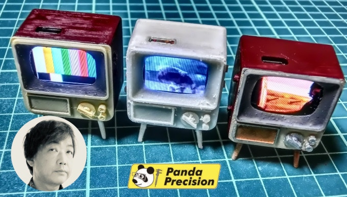
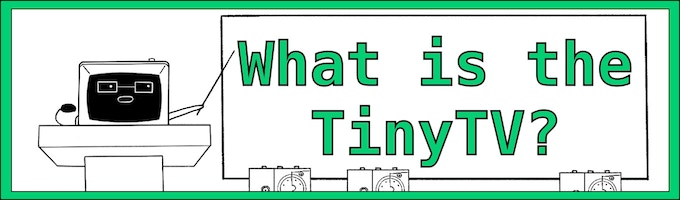
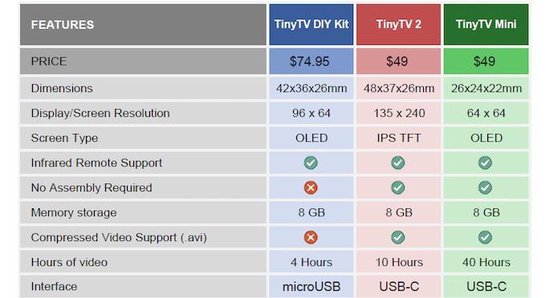

---
hide:
  - navigation
---
# 

The TinyTV 2 and TinyTV Mini are the latest in family of the TinyTV products, which began as a hobby project using the TinyCircuits TinyDuino family. Yashusi Enari, a TinyCircuits customer in Tokyo, Japan, discovered the [**TinyScreen+**](https://tinycircuits.com/products/tinyscreenplus "TinyScreen+ product page") and began creating his own tiny miniatures with these tiny screens. One of these projects was a retro miniature 3D printed television set, which he called the MAME-TV (Mame translates to "Bean" in English):

*Yashusi Enari's MAME-TV Project*

The project impressed his friends and gained enough popularity that Yashusi decided to start making more custom-painted TVs to sell to other miniature enthusiasts at events like Maker Faire Tokyo. He created a company named **Panda Precision** to do this, and started to collaborate with us at TinyCircuits to improve the kit.  He continued to 3D print and hand build all of the MAME-TVs in his Tokyo apartment, and it became increasingly popular where he had difficulty keeping up with demand.

Sadly, Yashusi was diagnosed with brain cancer in 2018 and began undergoing intensive treatment, which made it difficult to continue with his project that he was so passionate about.  In early 2019, a tumor was found in his brain, and he asked us to continue this project on his behalf. 

We then worked together on an improved version of the MAME-TV, which could scale up and be made available to more people - this work lead to the TinyTV DIY Kit.

Our friend Yashusi Enari passed away on May 1st, 2019. We miss him, and dedicate this project to his memory.

The MAME-TV project still lives on through Yashusi's friend Guru Hoshi in Japan, who continues making these [**amazing custom MAME-TVs**](https://g2hoshi.wixsite.com/mametv2 "MAME-TV Website for custom hand painted miniature TVs").

---

## TinyTV DIY Kit

Launched in late 2019, the TinyTV DIY Kit allowed people to create their own TinyTV, load their own videos, and paint the TV to look however they wanted. Built upon the TinyCircuits TinyDuino family, this kit has been extremely popular and well received. 

While the kit aspect of this is fun for a lot of people, we did hear from others who would prefer it already assembled, and easier to load their own videos on.  So we began working on the next generation TinyTV platform which we are launching as the TinyTV2 and TinyTV Mini.

---

## TinyTV Comparison

---

## Timeline

Spring 2017: Yasushi Enari creates the first prototype of the MAME-TV in Japan using the TinyCircuits TinyScreen+.  Yasushi contacts TinyCircuits to collaborate.
2017 - 2018: Yasushi hand makes MAME-TVs in Japan and sells to other hobbyists at conventions and it is quite popular and well received.
Jan 2019: Yasushi Enari is hospitalized with brain tumor and begins intensive treatment.  We begin working on creating the TinyTV DIY Kit with him.
May 1, 2019: Yasushi Enari passes away in Tokyo
Fall 2019: The TinyCircuits TinyTV DIY Kit is released 
April 2022: Completed redesign using the Raspberry Pi Pico processor, the RP2040
Summer 2022: Testing and Prototyping
Sept 2022: TinyTV 2 Beta units sent out to testers
Oct 2022: Kickstarter Campaign Begins
Nov 2022: Kickstarter Campaign Ends, component purchasing begins
Dec 2022: Shipping Begins to Early Bird Kickstarter backers
Jan 2023: Start mass production of electronics and plastic
Spring 2023: Shipping TinyTV 2 and TinyTV Minis to all Kickstarter Backers