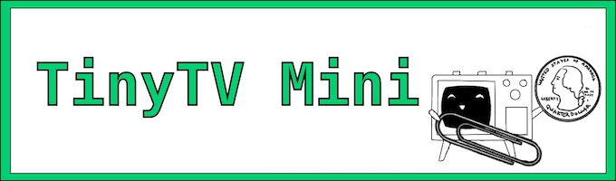

---
hide:
  - navigation
---

# 

**充電** - TinyTVを充電するには、USB-CケーブルをTinyTVの背面に差し込み、もう一方の端をパソコンまたはUSB充電器等に接続してください。

**電源オン/オフ** - 上には3つのボタンがあり、中央のボタンはテレビの電源をオン/オフにします。Tinyリモコンを使ってテレビの電源をオン/オフすることもできます。

**音量調整** - テレビの上部にある左側のボタンで音量設定を切り替えることができます。

**チャンネルを変える** - テレビの上部にある右側のボタンで、テレビに読み込んだ動画を選択できます。

---

#### 製品仕様

*	**寸法**：26.3mm x 23.8mm x 21.9mm (1.0インチ x 0.94インチ x 0.86インチ)
*	**ディスプレイ**：65KカラーOLED、15.2mm (0.6インチ)、64x64ピクセル
*	**バッテリー**：リチウムポリマー3.7V、50mAh、動画は約1時間再生可能 
*	**ストレージ**：内蔵8GB、約40時間分の動画
*	**オーディオ**：内蔵スピーカー
*	**ボタン**：本体の上部に電源ボタン、音量ボタン、チャンネルボタンがあります。
*	**リモコン**：赤外線（IR）リモコンで操作可能
*	**プロセッサー**：Raspberry Pi RP2040プロセッサー
*	**接続**：読み込み用と充電用のUSB-C ポート 

