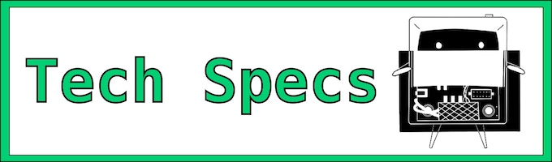

---
hide:
  - navigation
---

#

**充電** - TinyTVを充電するには、USB-CケーブルをTinyTVの背面に差し込み、もう一方の端をパソコンまたはUSB充電器等に接続してください。

**電源オン/オフ** - 上には3つのボタンがあり、中央のボタンはテレビの電源をオン/オフにします。Tinyリモコンを使ってテレビの電源をオン/オフすることもできます。

**音量調整** - 左側の回転ノブを回すと、音量を上げたり下げたりすることができます。 

**チャンネルを変える** - 右側の回転ノブを回すと、テレビに読み込まれた動画を選択できます。

---

#### 製品仕様

* **寸法**: 47.6mm x 36.6mm x 25.9mm (1.9インチ x 1.4インチ x 1.0インチ
* **ディスプレイ**: IPS TFT 65Kカラー、26mm (1.0インチ)、216x135ピクセル
* **バッテリー**: リチウムポリマー3.7V、150mAh、動画は約2時間再生可能 
* **ストレージ**: 内蔵8GB、約10時間分の動画
* **オーディオ**: 16x9mm (0.6インチ x 0.4インチ) フロントスピーカー
* **ボタン**: 電源ボタン、チャンネルと音量の調整用の回転ノブ2つ
* **リモコン**: 赤外線（IR）リモコンで操作可能
* **プロセッサー: Raspberry Pi RP2040プロセッサー
* **接続**: 読み込み用と充電用のUSB-C ポート

