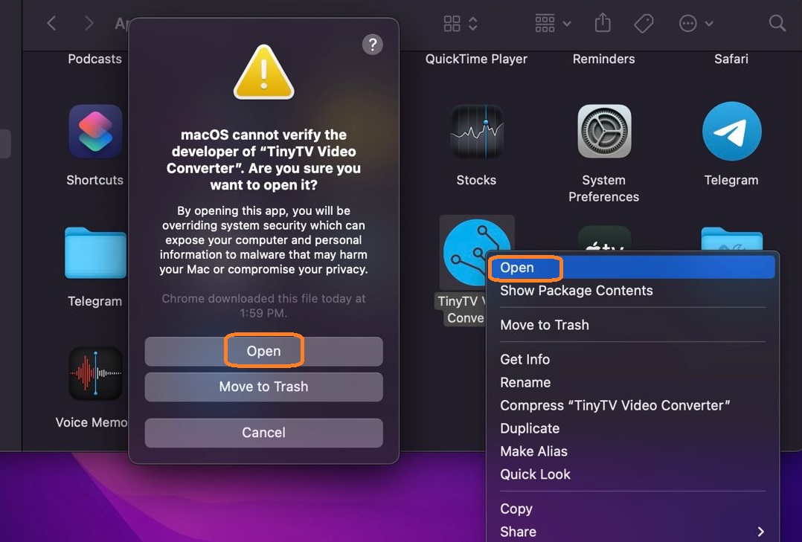
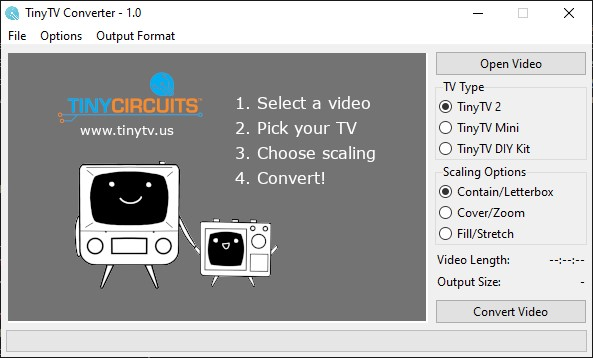

---
hide:
  - navigation
---

<!-- # TinyTV Converter App Download & Tutorial -->
#

## 動画の読み込み
TinyTV コンバーターアプリは、TinyCircuitsのTinyTVデバイスに対応した動画形式への変換とスケーリングするために使われます。TinyTVは小さいデバイスであり、特定の動画形式が必要なので、このチュートリアルで紹介されているアプリを使って、TinyTVで再生したい全ての動画を変換する必要があります。

_注意：<a href="https://tinycircuits.com/products/tinytv-diy-kit" target="_blank" alt="TinyTV Kit product page">**TinyTV DIY Kit**</a>キット（2023年夏以前に発送されたもの）に動画を変換して読み込みたい場合は、<a href="../TinyTV-DIY-Kit/TSV-Converter-Tutorial/" target="_blank" alt="TinyCircuits TSV Converter tutorial">**TSV Converter**</a>アプリのチュートリアルをご参照ください。_

## インストール

=== "Windows 版"

    - <a href="https://files.tinycircuits.com/TinyTVConverterWindows1.0.zip" download target="_blank" alt="Windows 64 bit Installer">**Windows 版ダウンロード**</a>（バージョン1.0.0、2023年6月27日更新、Windows 10 64ビット以降に対応） 

    上記のリンクをクリックして、ダウンロードが完了するまで待ってください。

    .exeファイルを解凍し、ダブルクリックして実行します。

    注意：ブラウザーがファイルの保持を確認する場合は、「はい」または「保持する」を選択してください。Windowsはファイルの実行について警告を表示することがありますが、その際は「詳細情報」をクリックし、「実行」を選択してください。

=== "MacOS 版"

    - <a href="https://files.tinycircuits.com/TinyTVConverter1.0.1b.zip" download target="_blank" alt="Mac Intel Installer">**MacOS 版ダウンロード**</a> バージョン1.0.1、2023年6月27日更新、IntelとApple Silicon、macOS 12.0.0以降に対応）

    TinyTVコンバーターアプリは現在署名されていないため、Finderでファイルを右クリックし、「開く」を選択し、警告ダイアログで再度「開く」をクリックしてください。

    

    

---

## TinyTV コンバーターの使い方

正しいシステム用のアプリケーションバージョンをダウンロードしたら、動画の変換を開始することができます！

1.	「動画を開く」ボタンをクリックし、変換する動画ファイルを選択してください。
2.	変換する動画のTVタイプを選択してください。
3.	動画に最適なスケーリングオプションを選択してください。
4.	「動画を変換する」ボタンをクリックしてください。保存場所とファイル名を指定してください（ファイル名は50文字以内にしてください）。

---

## 変換した動画のアップロード

- **接続**
    - TinyTV 2とMiniのユーザーは、USB-Cケーブルを使用してTVをコンピュータに接続してください。数秒後には外部ストレージドライブがコンピュータ上に表示されます
    - _注意：TinyTV DIYキットのユーザーは、TVからSDカードを取り外して、コンピュータまたはカードリーダーに挿入してください。_
 
- **コピー**
    - 変換された .avi ファイルを外部ドライブにコピー＆ペースト又はドラッグしてください。コピーが完了するまで、少し時間がかかる場合がありますので、しばらく待ってください。
 
- **取り出し**
    - ファイルのコピーが完了したら、外部ドライブを右クリックし、**「取り出し」**をクリックしてください。

---

## トラブルシューティング

- もしTinyTV 2またはTinyTV MiniのUSBデバイスがコンピュータ上に表示されない場合は、使用しているUSB-Cケーブルにデータ転送に対応していない可能性があります。他のUSB-Cケーブルを試してみてください。
- もし変換後の動画が表示されない場合は、保存したディレクトリ内でファイルエクスプローラーをリフレッシュしてください。動画が表示されない場合は、再度変換ボタンを押してみてください

---

## TinyTV Converter App version history:
* v1.0.0
    * Initial release of app written in Python.
* v0.1.2 
    * Added video file path for debugging. 
    * Signed and notarized MacOS version of application to remove downloading issues.
    * Moved 'Select a Video' button.
* v0.1.1 
    * Updated to include support for TinyTV DIY Kit .AVI conversion.
    * Updated the application name to reflect trademark protection.
    * Updated terminology to TV 'Model' instead of TV 'Option'.
    * TinyTV name labels updated/fixed.
    * TinyTV 2 is now the default selected option. 
    * Removed empty space in app.
* v0.1.0 Initial version with limited .TSV conversion functionality.

---

Thanks for supporting TinyCircuits!

